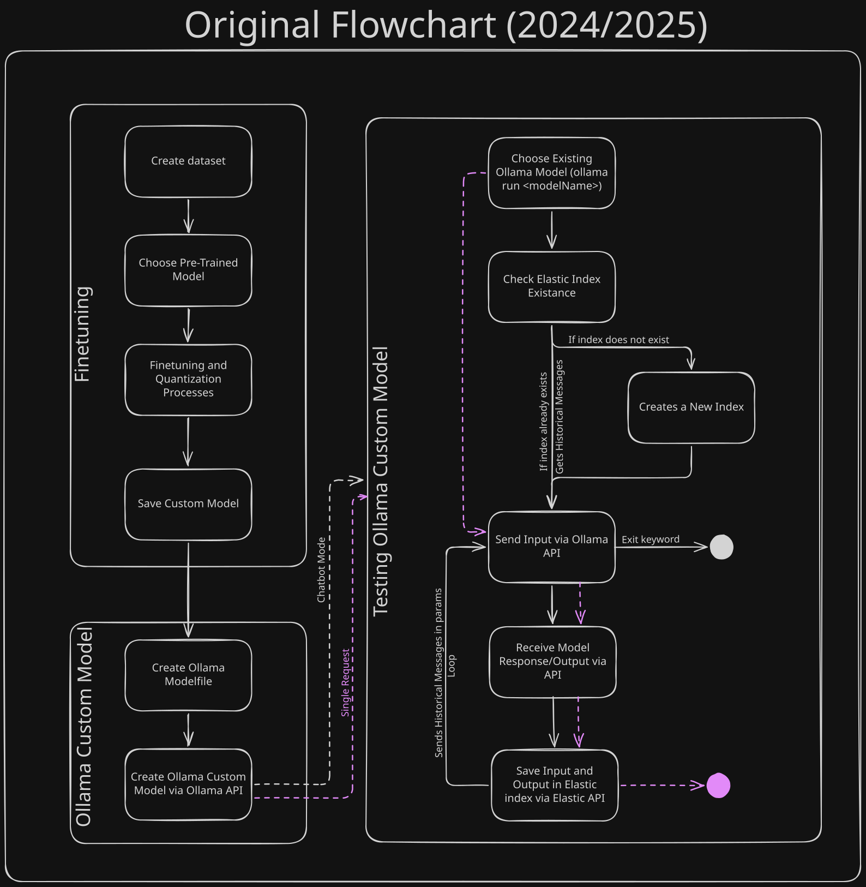

<h1 align="center"> Conversational Agent API </h1>

<h2 tabindex="-1" class="heading-element" dir="auto">Introduction</h2>

The aim of this project is to create a callable API of a custom conversational agent using LLM, Ollama and ElasticSearch. In future updates, I pretend to implement a multi-agent automation using CrewAi or other automation framework.

<h2 tabindex="-1" class="heading-element" dir="auto">Setup Virtual Environment</h2>

<h3 tabindex="-1" class="heading-element" dir="auto">1. Install Python3</h3>

<h3 tabindex="-1" class="heading-element" dir="auto">2. Create a Virtual Environment</h3>

Before installing the dependencies, I suggest you to create a python virtual environment in WSL (I'm using Ubuntu) for each program - <strong>1_finetuning, 2_ollama_custom_model and 3_ollama_testing</strong>.

<strong>Step 1: </strong>Run the command for the python version you're using:
<code>sudo apt install python3.12-venv</code>

<strong>Step 2: </strong>Create the virtual environment by running the following command in terminal:
<code>python3 -m venv venv</code>

<strong>Step 3: </strong>Activate the virtual environment by running the following command in terminal (linux).
<code>source venv/bin/activate</code>

<h3 tabindex="-1" class="heading-element" dir="auto">3. Install Dependencies</h3>

Install pytorch using the following command:
<code>pip3 install torch torchvision torchaudio --index-url https://download.pytorch.org/whl/cu121</code>

Install ollama using the following command (in linux -> base directory):
<code>curl -fsSL https://ollama.com/install.sh | sh</code>

Install dependencies using the file <em>requirements.txt</em>:
<code>pip install -r requirements.txt</code>

Or install dependencies separately. For example: <code>pip install trl peft accelerate bitsandbytes triton transformers xformers</code>

<h2 tabindex="-1" class="heading-element" dir="auto">Finetuning</h2>

<h3 tabindex="-1" class="heading-element" dir="auto">1. Building Finetuning Dataset</h3>

The dataset must be saved as <strong><em>filename.json</em></strong> in <strong><em>1_finetuning/static</em></strong> and its content/dialog MUST have the following format:

<code>[
    {
        "instruction": "Description of the character",
        "input": "User/player input",
        "output": "How the AI must answer the question"
    },
    .....
]
</code>

<h3 tabindex="-1" class="heading-element" dir="auto">2. Run <em>Finetuning</em></h3>

Use the <code>cd</code> command to reach the directory <strong><em>1_finetuning</em></strong> which contains the files to perform the finetuning, then run the command below:

<code>python3 main.py</code>

<h2 tabindex="-1" class="heading-element" dir="auto"> Creating Ollama Custom Model </h2>

<!-- <h3 tabindex="-1" class="heading-element" dir="auto">1. Create Ollama API</h3> -->

Use the <code>cd</code> command to reach the directory <strong><em>2_ollama_custom_model</em></strong> which contains the files to perform the creation of an Ollama Custom Model, then run the command below following the instructions given in execution:

<code>python3 main.py</code>

Once the code runs smoothly, run in terminal:

<code>ollama list</code> - to list all existing local models

<code>ollama run chosen_modelname</code> - to run the chosen model

<h2 tabindex="-1" class="heading-element" dir="auto">Testing Ollama Custom Model</h2>

<!-- <h3 tabindex="-1" class="heading-element" dir="auto">2. Run Ollama API</h3> -->

Use the <code>cd</code> command to reach the directory <strong><em>3_ollama_testing</em></strong> which contains the files to test the custom model, then run the commands below and follow the instructions:

<code>curl -fsSL https://elastic.co/start-local | sh</code>

Remember to update the environment variables in .env, using the ones given by the command above.

<code>python3 main.py</code>

<h2 tabindex="-1" class="heading-element" dir="auto">Flowchart</h2>

